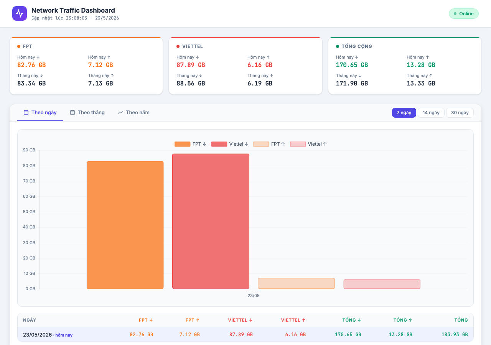

# MikroTik Traffic Dashboard v2.0

*Read this in other languages: [English](#english-version)*

MikroTik Traffic Dashboard là một ứng dụng Node.js hiện đại, nhẹ nhàng dùng để theo dõi lưu lượng mạng (Download/Upload) của các đường truyền WAN trên Router MikroTik. Phiên bản 2.0 mang đến một kiến trúc hoàn toàn mới, hỗ trợ tự động nhận diện nhiều đường truyền và tích hợp sẵn Giao diện Cấu hình Web.



## ✨ Điểm mới trong v2.0
- **Đường truyền động**: Không còn bị giới hạn cứng vào FPT/Viettel. Bạn có thể thêm bao nhiêu đường truyền mạng tùy ý (VNPT, CMC, Starlink, v.v.).
- **Giao diện Cấu hình (Web UI)**: Thiết lập IP Router, cấu hình API và các đường mạng trực tiếp trên trình duyệt mà không cần đụng vào file JSON hay code.
- **Tự động sinh Script**: Hệ thống tự động viết kịch bản (script) để copy vào RouterOS dựa trên cấu hình mạng của riêng bạn.
- **Bảo mật tuyệt đối**: Thông tin kết nối API được lưu cục bộ trên server và **không bao giờ bị rò rỉ** ra giao diện frontend.
- **Trải nghiệm UI/UX tốt hơn**: Màu sắc trực quan, bảng điều khiển tự co giãn, và chặn lỗi thông minh.

## 🚀 Tính năng chính
- **Theo dõi theo thời gian thực**: Tự động tải dữ liệu mỗi 5 phút.
- **Phân tích lịch sử**: Xem lại dữ liệu đã sử dụng theo **Giờ**, **Ngày**, **Tháng** và **Năm**.
- **Biểu đồ mượt mà**: Sử dụng Chart.js để vẽ biểu đồ sắc nét và tương tác tốt.
- **Không cần cài đặt Database**: Dữ liệu được lưu thẳng vào file JSON nhẹ nhàng (`history.json`, `hourly.json`).

## ⚙️ Yêu cầu hệ thống
- **Node.js** (phiên bản v14 trở lên)
- **MikroTik RouterOS** (phiên bản v6 hoặc v7) đã bật tính năng REST API.

## 🛠️ Hướng dẫn Cài đặt

1. **Tải mã nguồn**:
   ```bash
   git clone https://github.com/manh9992/mikrotik-traffic-dashboard.git
   cd mikrotik-traffic-dashboard
   ```

2. **Cài đặt thư viện**:
   ```bash
   npm install express
   ```

3. **Chạy server**:
   ```bash
   node server.js
   ```
   *(Khuyên dùng `pm2` hoặc `systemd` để chạy ẩn 24/7).*

4. **Truy cập Dashboard**:
   Mở trình duyệt và vào địa chỉ `http://<ip-may-chu>:3001`.

## 🌐 Hướng dẫn Cấu hình

Việc thiết lập giờ đây đã tự động hóa 100% qua Giao diện Web:

1. Bấm nút **"Hệ thống"** ở góc phải màn hình.
2. Nhập địa chỉ IP, User và Password của Router (Để trống nếu bạn không muốn đổi).
3. Bấm **"+ Thêm đường truyền"** để định nghĩa các mạng bạn có:
   - **ID (Mã)**: Mã nội bộ (VD: `wan1`)
   - **Tên hiển thị**: Tên hiện trên Dashboard (VD: `VNPT`)
   - **Màu sắc**: Chọn màu biểu đồ bạn thích
   - **Tên interface MikroTik**: Tên interface chuẩn xác trong Winbox (VD: `ether1-WAN`)
4. Bấm **Lưu cấu hình**. Trang web sẽ tự động khởi động lại.
5. Bấm nút **"Script MikroTik"** để lấy đoạn code đã được sinh tự động và dán vào System -> Scheduler của Router.

---

<h1 id="english-version">MikroTik Traffic Dashboard v2.0 (English)</h1>

MikroTik Traffic Dashboard is a lightweight, modern, and dynamic Node.js dashboard designed to monitor your MikroTik Router's WAN traffic (Download/Upload). Version 2.0 introduces a complete architectural overhaul, featuring dynamic interface mapping and a built-in Web Configuration UI.

## ✨ New in v2.0
- **Dynamic Interfaces**: No longer hardcoded to FPT/Viettel. You can add as many WAN interfaces as you want (VNPT, CMC, Starlink, etc.).
- **Web UI Configuration**: Configure your Router IP, API credentials, and network interfaces directly from the web browser without touching any JSON or code files.
- **Automated Script Generation**: Automatically generates the exact RouterOS scripts you need based on your custom interface names.
- **Enhanced Security**: API credentials are saved locally on the server but are **never exposed** to the frontend UI, preventing unauthorized snooping.
- **Improved UI/UX**: Solid modal backgrounds, responsive tables, interactive color pickers, and smart validation.

## 🚀 Features
- **Real-time Monitoring**: Automatically fetches traffic snapshots every 5 minutes.
- **Historical Analysis**: View traffic usage by **Hour**, **Day**, **Month**, and **Year**.
- **Interactive Charts**: Powered by Chart.js for beautiful, responsive data visualization.
- **Zero Database Setup**: Uses lightweight JSON flat-file storage (`history.json`, `hourly.json`).

## ⚙️ Requirements
- **Node.js** (v14 or higher)
- **MikroTik RouterOS** (v6 or v7) with REST API enabled.

## 🛠️ Installation

1. **Clone the repository**:
   ```bash
   git clone https://github.com/manh9992/mikrotik-traffic-dashboard.git
   cd mikrotik-traffic-dashboard
   ```

2. **Install dependencies**:
   ```bash
   npm install express
   ```

3. **Start the server**:
   ```bash
   node server.js
   ```

4. **Access the Dashboard**:
   Open your browser and navigate to `http://<your-server-ip>:3001`.

## 🌐 Configuration Guide
1. Click on the **System Config** button on the top right.
2. Enter your Router's IP Address.
3. Click **"+ Add Interface"** to define your WAN links.
4. Click **Save**. The dashboard will automatically reload.
5. Click the **"MikroTik Script"** button to grab the autogenerated tracking scripts and paste them into your RouterOS system scheduler.

## 📝 License
MIT License.
