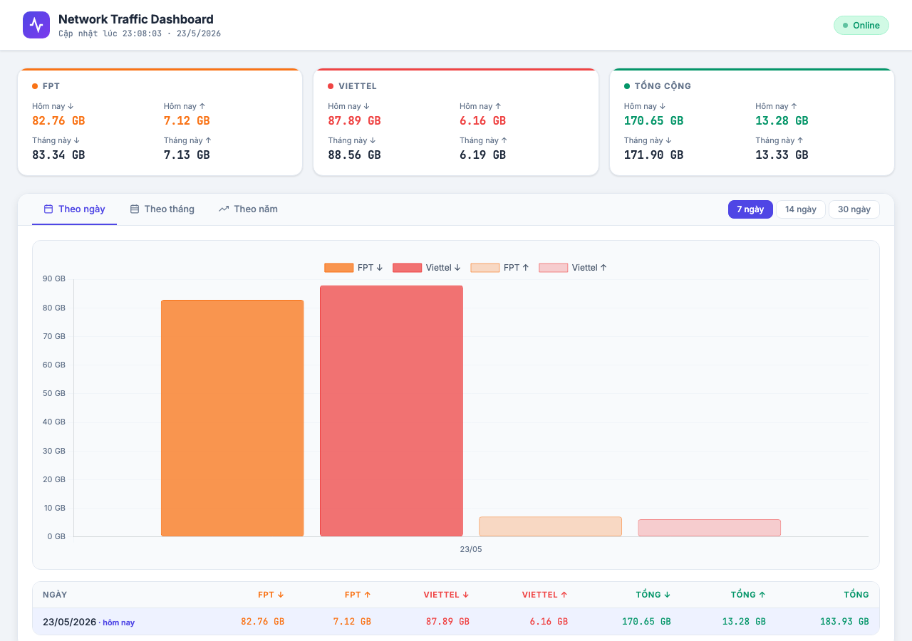

# MikroTik Traffic Dashboard v3.0

*Read this in other languages: [English](#english-version)*

MikroTik Traffic Dashboard là một ứng dụng Node.js hiện đại, nhẹ nhàng dùng để theo dõi lưu lượng mạng (Download/Upload) của các đường truyền WAN trên Router MikroTik. Phiên bản 3.0 mang đến một bước đột phá lớn: **Chuyển đổi hoàn toàn sang cơ chế SNMP**, đọc dữ liệu trực tiếp từ RAM của router, giúp bảo vệ bộ nhớ NAND (zero NAND write) và tăng tốc độ cập nhật.



## ✨ Điểm mới trong v3.0
- **Cơ chế SNMP (Zero NAND Write)**: Đọc thông số lưu lượng (`tx-byte`, `rx-byte`) trực tiếp từ RAM của router thông qua SNMP. Hoàn toàn không ghi bất kỳ file nào lên bộ nhớ trong (NAND) của MikroTik.
- **Tốc độ cập nhật cực nhanh**: Server tự động poll dữ liệu mỗi 30 giây thay vì 5 phút như bản cũ. Dữ liệu trên web tự động làm mới mỗi 1 phút.
- **Không cần Script trên Router**: Bạn không cần tạo bất kỳ Script hay Scheduler nào trên RouterOS nữa. Trả lại sự sạch sẽ tuyệt đối cho cấu hình router của bạn.
- **Đường truyền động**: Thêm bao nhiêu đường truyền tùy ý qua Giao diện Web. Hệ thống SNMP tự động quét (walk) và nhận diện đúng cổng (interface) trên router.

## 🚀 Tính năng chính
- **Theo dõi thời gian thực**: Biểu đồ tự động cập nhật liên tục.
- **Phân tích lịch sử**: Xem lại dữ liệu đã sử dụng theo **Giờ**, **Ngày**, **Tháng** và **Năm**.
- **Biểu đồ mượt mà**: Sử dụng Chart.js để vẽ biểu đồ sắc nét và tương tác tốt.
- **Không cần cài đặt Database**: Dữ liệu được lưu thẳng vào file JSON nhẹ nhàng (`history.json`, `hourly.json`).

## ⚙️ Yêu cầu hệ thống
- **Node.js** (phiên bản v14 trở lên)
- **MikroTik RouterOS** (phiên bản v6 hoặc v7) đã bật **SNMP** và **REST API**.

## 🛠️ Hướng dẫn Cài đặt

1. **Tải mã nguồn**:
   ```bash
   git clone https://github.com/manh9992/mikrotik-traffic-dashboard.git
   cd mikrotik-traffic-dashboard
   ```

2. **Cài đặt thư viện**:
   ```bash
   npm install
   ```

3. **Chạy server**:
   ```bash
   node server.js
   ```
   *(Khuyên dùng `pm2` hoặc `systemd` để chạy ẩn 24/7).*

4. **Truy cập Dashboard**:
   Mở trình duyệt và vào địa chỉ `http://<ip-may-chu>:3001`.

## 🌐 Hướng dẫn Cấu hình

Việc thiết lập giờ đây cực kỳ đơn giản:

1. Bấm nút **"Hệ thống"** ở góc phải màn hình.
2. Nhập địa chỉ IP, User và Password của Router.
3. Bấm **"+ Thêm đường truyền"** để định nghĩa các mạng bạn có:
   - **ID (Mã)**: Mã nội bộ (VD: `wan1`)
   - **Tên hiển thị**: Tên hiện trên Dashboard (VD: `VNPT`)
   - **Màu sắc**: Chọn màu biểu đồ bạn thích
   - **Tên interface MikroTik**: Tên interface chuẩn xác trong Winbox (VD: `ether1-WAN`)
4. Bấm **Lưu cấu hình**. Trang web sẽ tự động khởi động lại.
5. Bấm nút **"Cài đặt MikroTik"** để copy lệnh bật SNMP dán vào Terminal của Winbox là xong!

---

<h1 id="english-version">MikroTik Traffic Dashboard v3.0 (English)</h1>

MikroTik Traffic Dashboard is a lightweight, modern, and dynamic Node.js dashboard designed to monitor your MikroTik Router's WAN traffic (Download/Upload). Version 3.0 introduces a massive upgrade: **A complete shift to SNMP**, fetching data directly from the router's RAM, ensuring zero NAND writes and significantly faster update intervals.

## ✨ New in v3.0
- **SNMP Engine (Zero NAND Write)**: Reads traffic counters (`tx-byte`, `rx-byte`) directly from the router's RAM via SNMP. Absolutely no file writes to the MikroTik's flash memory.
- **Lightning Fast Updates**: The backend polls data every 30 seconds (up from 5 minutes). The web UI automatically refreshes every minute.
- **No RouterOS Scripts Needed**: You no longer need to install clunky scripts or schedulers on your router.
- **Dynamic Interfaces**: Add any number of WAN links via the Web UI. The SNMP engine automatically discovers and binds to the correct interfaces.

## 🚀 Features
- **Real-time Monitoring**: Automatically fetches traffic snapshots.
- **Historical Analysis**: View traffic usage by **Hour**, **Day**, **Month**, and **Year**.
- **Interactive Charts**: Powered by Chart.js for beautiful, responsive data visualization.
- **Zero Database Setup**: Uses lightweight JSON flat-file storage (`history.json`, `hourly.json`).

## ⚙️ Requirements
- **Node.js** (v14 or higher)
- **MikroTik RouterOS** (v6 or v7) with **SNMP** and **REST API** enabled.

## 🛠️ Installation

1. **Clone the repository**:
   ```bash
   git clone https://github.com/manh9992/mikrotik-traffic-dashboard.git
   cd mikrotik-traffic-dashboard
   ```

2. **Install dependencies**:
   ```bash
   npm install
   ```

3. **Start the server**:
   ```bash
   node server.js
   ```

4. **Access the Dashboard**:
   Open your browser and navigate to `http://<your-server-ip>:3001`.

## 🌐 Configuration Guide
1. Click on the **System Config** button on the top right.
2. Enter your Router's IP Address and REST API credentials.
3. Click **"+ Add Interface"** to define your WAN links.
4. Click **Save**. The dashboard will automatically reload.
5. Click the **"MikroTik Setup"** button to copy the command that enables SNMP on your router and paste it into Winbox.

## 📝 License
MIT License.
